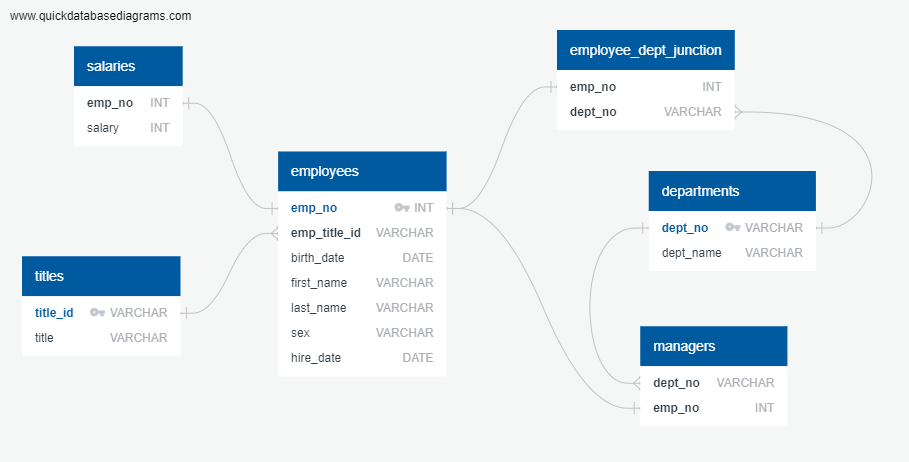

# sql-challenge module9challenge

This folder contains solutions to the Pewlett Hackard SQL challenge (Module 9)

Included is the original data in the EmployeeSQL folder, an ERD image exported from Quick DBD, schema.sql file and queries.sql file.

## Instructions

* Open the ERD.png to view relations between entitites and attributes. This image is displayed below.
* Use the schema.sql file to create tables and thereafter import files. An import order is suggested at the bottom of the schema.sql file.
* Use the queries.sql to run the Analysis queries in the challenge.

## References

Quick DBD was used for generating the ERD and exporting initial schema to create tables: https://www.quickdatabasediagrams.com/

## ERD

